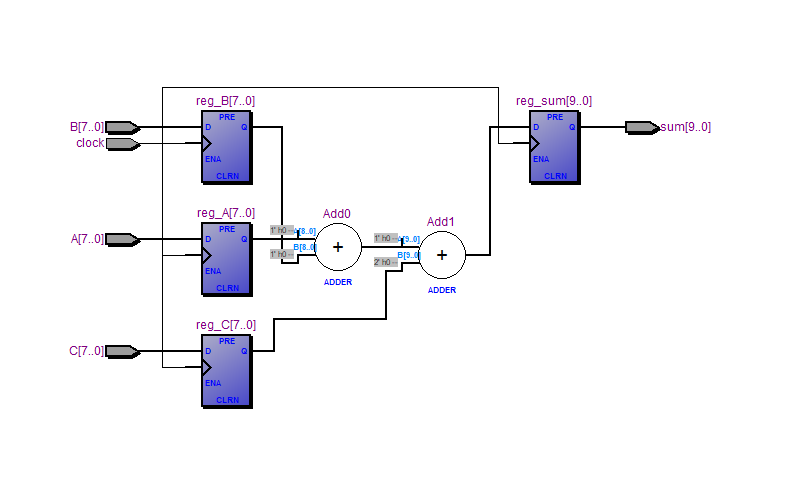
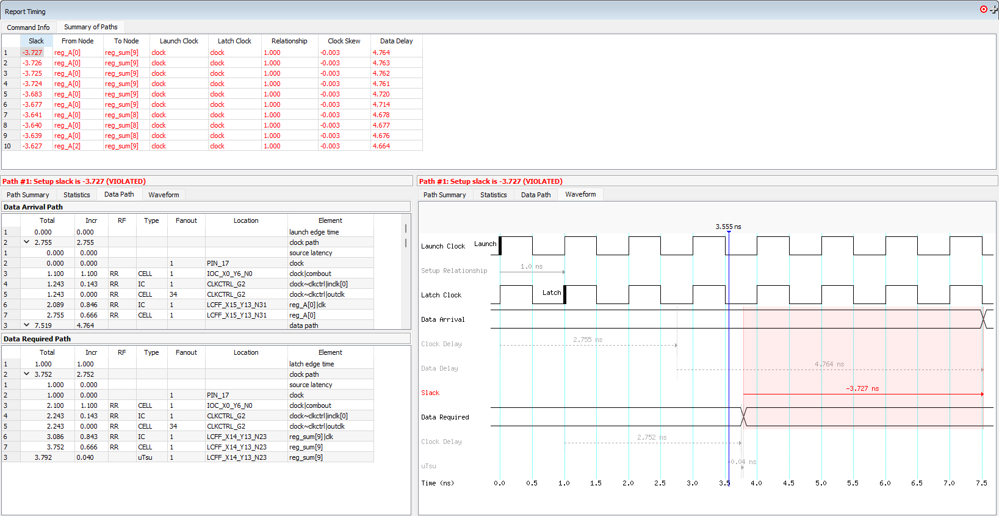
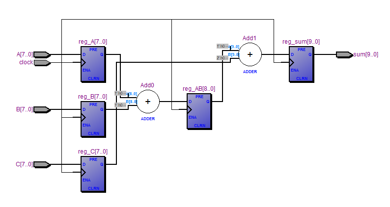
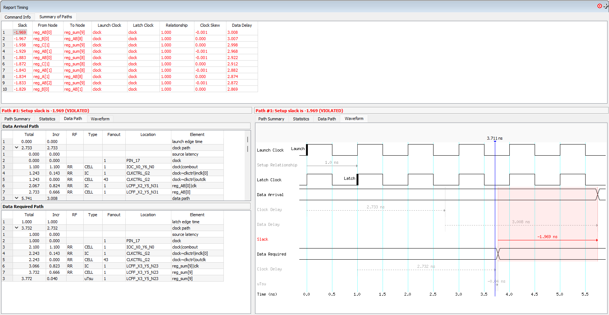

# adders_time_constrains
Board: Cyclone II EP2C5T144C8N
This project is  created to research:
- Design influence on latency/delay
- Compare the differences between optimization options of EDA tool/CAD software

